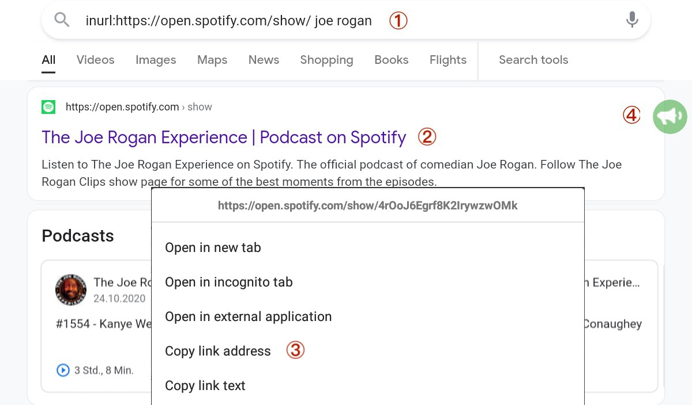
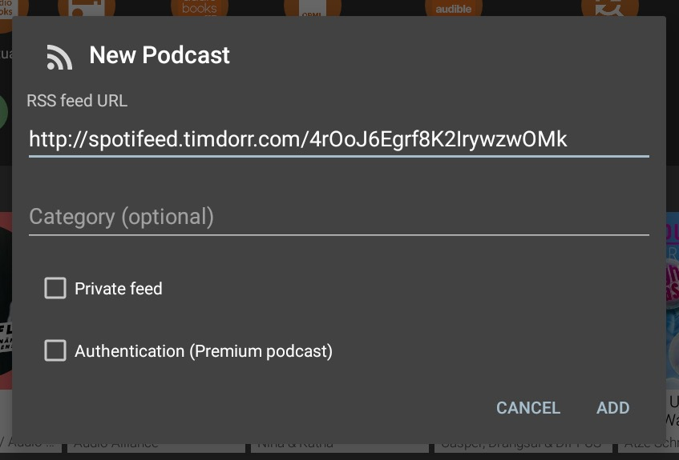
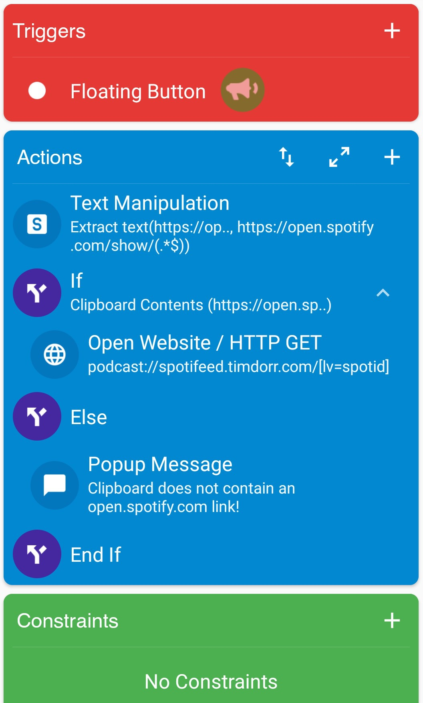

# SpotiFeed4MacrodDroid

A very simple Android [MacroDroid](https://www.macrodroid.com/) macro to subscribe to Open Spotify podcasts with any podcast app. See [references](#references)

# IMPORTANT NOTE
**As Spotifeed has been discontinued, this macro no longer works**!

From the Spotifeed website:
*Unfortunately, Spotify has made critical changes to their podcast download infrastructure that prevents Spotifeed from working.
(...)
For exclusive podcasts, Spotify is using their audio-fa.scdn.co server, which appears to be using a chunked MP4 stream that is not usable by general podcast clients.*
[more ...](https://spotifeed.timdorr.com/)

## Download Link
[https://github.com/einstweilen/spotifeed4macrodroid/releases](https://github.com/einstweilen/spotifeed4macrodroid/releases)

## How To Use
① Search a podcast on Spotify or use Google search:

[inurl:https://open.spotify.com/show/](https://www.google.com/search?q=inurl:https://open.spotify.com/show/)

② Copy any open.spotify.com link to the ③ clipboard and press the ④ green megaphone button.
The link will be converted and your standard ⑤ podcast app will launch.

## References:

* [Tim Dorr's service to serve up Spotify podcasts as RSS feeds for use in any podcast app](https://github.com/timdorr/spotifeed)
* [MacroDroid](https://www.macrodroid.com/) for Android, free trial version (up to five macros) 
* [Spotify](https://www.spotify.com/)

## Online Tool & iOS Shortcut
Tim Dorr's [Online Converter](https://spotifeed.timdorr.com/)

[Manaburner](https://twitter.com/Manaburner)'s [iOS Shortcut](https://www.icloud.com/shortcuts/e7cb5cf823f84c4f9f71ccc33296144d)
